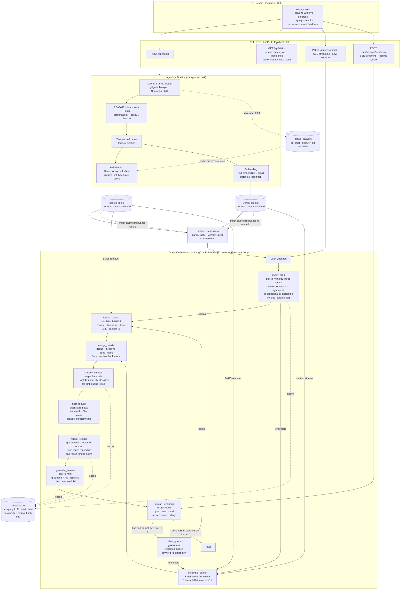

# AskMyBookmark: AIE9 Certification Challenge

Query your GitHub starred repositories using natural language, powered by RAG.

---

## Running Locally

### Prerequisites

- Python 3.11+
- Node.js 18+
- [uv](https://docs.astral.sh/uv/) (Python package manager)

### 1. Clone the repo

```bash
git clone <your-repo-url>
cd aie9-cert-challenge-AskMyBookmark
```

### 2. Set up your environment variables

Create a `notebooks/.env` file with your OpenAI API key:

```bash
cp notebooks/.env.example notebooks/.env   # if the example exists, otherwise create it
```

Add the following to `notebooks/.env`:

```
OPENAI_API_KEY=sk-...
```

> `notebooks/.env` is listed in `.gitignore` and will never be committed.

### 3. Install Python dependencies

```bash
uv sync
```

### 4. Start the app

```bash
uv run ./start-dev.sh
```

This starts both servers:
- **Backend** → http://localhost:8000 (FastAPI)
- **Frontend** → http://localhost:3000 (Next.js)

`npm install` for the frontend runs automatically on first launch.

### 5. Open the app

Go to **http://localhost:3000** in your browser.

Enter your GitHub Personal Access Token and click **Load My Bookmarks**.

> If `data/cached/github_data.pkl` exists, the app loads from that cache instead of calling the GitHub API, making startup much faster.

---

## Project Structure

```
app/
  ask_my_bookmark.py   # FastAPI backend, RAG pipeline + API endpoints
frontend/
  pages/index.tsx      # Next.js single-page UI
  styles/globals.css
data/
  cached/
    github_data.pkl    # Cached GitHub starred repo data (not committed)
notebooks/
  .env                 # Your API keys (not committed, add OPENAI_API_KEY here)
  POC_AskMyBookmark_cleaner.ipynb   # RAG pipeline prototyping notebook
```

---

## Stack

| Layer | Choice |
|---|---|
| LLM | `gpt-4o-mini` (OpenAI) |
| Embeddings | `text-embedding-3-small` (OpenAI) |
| Orchestrator | LangGraph `StateGraph` + `MemorySaver` |
| BM25 Retriever | `SearchArray` multi-field (boosted) |
| Vector DB | Qdrant (on-disk persistent, per-user) |
| Backend | FastAPI + uvicorn (SSE streaming) |
| Frontend | Next.js (TypeScript) |

---

## Certification Challenge Sections

### 1) Problem & Audience

**Developers lose the value of their saved resources because traditional bookmark systems can't bridge the gap between how people remember things and how those systems store them.**

Knowledge workers, especially software developers, continuously accumulate saved resources: GitHub repositories, tutorials, documentation, and blog posts. These are typically saved in the moment, without tags or annotations, because the overhead of organizing mid-flow is too high. The result is a growing archive that becomes increasingly difficult to navigate.

Traditional bookmark managers depend on folder hierarchies or exact keyword search. This model breaks down in practice: users remember the *concept* or *intent* behind a bookmark, such as "that animation library I saved," "the auth template for beginners," or "the vector database getting-started guide," but rarely the exact title, URL, or phrasing needed to retrieve it. The cognitive mismatch between semantic memory and literal storage means saved resources effectively become lost over time. The problem is not capacity; it is retrieval.

AskMyBookmark addresses this directly. By indexing a developer's GitHub starred repositories and exposing them through a natural language interface backed by a RAG pipeline, it allows users to query their own knowledge base the way they actually think, conversationally and by meaning, rather than by exact string match.

### 2) Proposed Solution & Stack

AskMyBookmark transforms a user's GitHub starred repositories into a conversational, queryable knowledge base. The system fetches repository content (READMEs and root-level markdown files) via the GitHub API, preprocesses and normalizes that content, generates dense vector embeddings for semantic search, and routes natural language queries through a RAG pipeline that returns grounded, cited answers, not just a list of URLs.

Example queries the system handles:

- *"What tutorials did I save about RAG pipelines?"*
- *"Show me beginner-friendly AI projects I bookmarked."*
- *"Do I have any repos related to finance?"*

Rather than a keyword match, the system returns concise summaries explaining *why* each repository is relevant, with links back to the original GitHub URL. The interface behaves like a personal research assistant that has read everything the user has starred.

#### System Architecture



#### Stack Justification

| Layer | Tool | Rationale |
|---|---|---|
| **LLM** | `gpt-4o-mini` (OpenAI) | Used for all LLM steps: query prep, curated-list classification, LLM reranking, and answer generation. Structured-output mode is used for the first three to get deterministic JSON. Cost-efficient with strong reasoning for a 6-node orchestrator |
| **Embeddings** | `text-embedding-3-small` (OpenAI) | 1536-dimension dense embeddings; strong semantic recall for technical content at low cost per token |
| **Orchestrator** | LangGraph `StateGraph` + `MemorySaver` | Multi-node graph with typed `OrchestratorState`; `MemorySaver` checkpointer enables the `human_feedback` INTERRUPT/resume pattern so feedback loop state persists across HTTP requests |
| **BM25 Retriever** | `SearchArray` (multi-field) | Pandas-native BM25 with per-field boost weights (`repo x3`, `topics x2`, `description x1.5`, `content x1`) and dismax scoring; avoids spawning a separate search service |
| **Vector DB** | Qdrant (on-disk persistent) | Per-user on-disk collection persists the index across server restarts; hash-validated against `github_data.pkl` for automatic invalidation when the source data changes |
| **Data Ingestion** | `gidgethub` (async) | Native async pagination over GitHub's REST API; semaphore-throttled fan-out across 2000+ repos without hitting rate limits |
| **Preprocessing** | `textacy` | Composable normalization pipeline (Markdown stripping, HTML removal, unicode normalization, whitespace collapsing) producing clean plain-text embeddings |
| **Backend** | FastAPI + uvicorn | Async-native; SSE streaming via `StreamingResponse` for live query progress; background task for pipeline build with granular `index_step` progress reporting |
| **UI** | Next.js (TypeScript) | React-based SPA with setup, loading, query, and per-repo emoji feedback states; `react-markdown` renders LLM responses with clickable GitHub links |

### 3) Data & Chunking

#### Data Source, GitHub Starred Repositories

All data is fetched live from GitHub's REST API using [`gidgethub`](https://github.com/brettcannon/gidgethub), an async-native GitHub API client built on top of `aiohttp`. The authenticated user's starred repositories are collected via a paginated `GET /user/starred` request:

```python
async for repo in gh.getiter(
    "/user/starred",
    accept="application/vnd.github.mercy-preview+json",
):
    starred.append(repo)
```

The `application/vnd.github.mercy-preview+json` accept header is required to include the `topics` field in the response payload; without it, topic tags are omitted from each repository object.

All 2000+ repos are fetched concurrently using `asyncio.gather` throttled by an `asyncio.Semaphore(20)` to avoid saturating GitHub's rate limit. You will receive HTTP 502 gateway errors if there are too many concurrent tasks hitting Github's API without the Semaphore pattern.

#### Per-Repository Fields Collected

The following fields are extracted from each starred repository response and stored as document metadata:

| Field | Source | Used For |
|---|---|---|
| `full_name` | `repo["full_name"]` | Document ID (UUID5), display, citations |
| `description` | `repo["description"]` | Document content + metadata |
| `topics` | `repo["topics"]` | Prepended to embedding text; filterable metadata |
| `stargazers_count` | `repo["stargazers_count"]` | Metadata shown in results |
| `language` | `repo["language"]` | Metadata shown in results |
| `html_url` | `repo["html_url"]` | Citation links in LLM response |

#### README / Documentation Fetch Strategy

For each repository, documentation is fetched using the following priority order:

1. **`GET /repos/{owner}/{name}/readme`** — GitHub's dedicated readme endpoint, which resolves `README.md`, `README.rst`, `readme.md`, etc. automatically. Content is returned as Base64 and decoded to UTF-8.
2. **Fallback, `GET /repos/{owner}/{name}/contents/`** — If no README exists (HTTP 404), the root directory is listed and all `.md` files are fetched individually.
3. **No docs** — If neither approach yields content, the repo is indexed with an empty document body (description and topics still contribute to the embedding).

All fetch operations use `stamina.retry` with exponential backoff (3 attempts, 0.5 s initial wait, 10 s max) and skip retrying on deterministic 404/403 responses.

#### Text Preprocessing

Before embedding, raw markdown content is passed through a `textacy`-based normalization pipeline:

1. Strip Markdown syntax (headings, bold/italic, inline code, link markup)
2. Remove HTML tags
3. Normalize bullet points and quotation marks
4. Unicode normalization (NFC form)
5. Collapse excess whitespace

Repository topics are prepended as plaintext (`Topics: tag1,tag2,...`) before the normalized README body to boost topic-signal in the embedding.

#### No Chunking Strategy, By Design

AskMyBookmark does not chunk documents. Each repository is treated as a single document. This is intentional: the vast majority of GitHub READMEs are short, typically 500-3,000 tokens, and do not benefit from sub-document splitting. Chunking would fragment the coherent description of a repository across multiple vectors, making retrieval noisier rather than more precise. The unit of retrieval is the repository, not a paragraph within it.

For the small number of repositories with very long READMEs (e.g. "awesome lists" with hundreds of linked resources), content is hard-truncated at **30,000 characters** before normalization. This limit exists because `text-embedding-3-small` has a context window of **8,191 tokens** (roughly 32,000 characters). Truncating at 30,000 characters provides a safe margin to avoid silent token truncation by the embedding model while preserving the most informative portion of the document (typically the introduction and feature descriptions at the top).

### 4) End-to-End Prototype

#### How it works

The prototype runs entirely on localhost with two processes: a FastAPI backend on port 8000 and a Next.js frontend on port 3000. Both are started together by the `start-dev.sh` convenience script from the project root. The script checks whether `frontend/node_modules` exists and runs `npm install` automatically if it does not, so there is no separate frontend setup step.

The backend is launched with `uvicorn` in `--reload` mode, which means any changes to `app/ask_my_bookmark.py` are picked up instantly without restarting the server. The frontend is launched with `next dev`, which provides the same hot-reload behaviour for UI changes.

Once both servers are running, opening `http://localhost:3000` in a browser presents the setup screen. The user enters their GitHub Personal Access Token and clicks **Load My Bookmarks**. This sends a `POST /api/setup` request to the backend, which immediately returns and kicks off a background task. The background task has two phases:

1. **Fetching** — all starred repositories and their README content are fetched from GitHub concurrently. If `data/cached/github_data.pkl` exists (as it does in this repo), this step is skipped entirely and the cached data is loaded from disk instead, making startup significantly faster.
2. **Indexing** — the fetched documents are normalized via the `textacy` pipeline, embedded using `text-embedding-3-small`, and inserted into an in-memory Qdrant vector store. This step makes outbound calls to the OpenAI Embeddings API and typically takes a few minutes for 2000+ repositories.

The frontend polls `GET /api/status` every 2 seconds and displays live progress. Once the backend reports `status: "ready"`, polling stops and the query interface appears.

The user types a natural language question and submits it. The frontend sends a `POST /api/query` to the backend, which invokes the compiled LangGraph pipeline. The pipeline runs two nodes in sequence: `retrieve_node` performs a cosine similarity search over the Qdrant collection (top 10 results), and `generate_node` formats those results into a structured prompt and calls `gpt-4.1-nano` to produce a grounded, markdown-formatted response. The response is streamed back to the frontend and rendered with clickable GitHub links.

The LangGraph `StateGraph` wires these two nodes together with a typed `State` dictionary (`question`, `context`, `response`), making the data flow explicit and the pipeline easy to extend; for example, adding a reranking node between retrieval and generation requires only inserting a new node into the sequence.

#### Quick-start steps

```bash
# 1. Activate the Python environment and start both servers
cd /path/to/aie9-cert-challenge-AskMyBookmark
uv run ./start-dev.sh
```

```bash
# 2. In a second terminal, start the frontend (if not using start-dev.sh)
cd frontend
npm run dev
```

Then:

1. Open **http://localhost:3000** in your browser
2. Enter your GitHub Personal Access Token in the input field
3. Click **Load My Bookmarks**, the app will load from cache if available, otherwise fetch from GitHub
4. Wait for the indexing phase to complete (progress shown on screen)
5. Type a question in the search box and press **Ask**

### 5) Golden Test Set & RAGAS

#### Evaluation Design

AskMyBookmark is a **search and discovery** tool, not a factual Q&A system. This matters because most RAGAS metrics are designed for tasks where a single correct reference answer exists. A query like *"show me repos about Bayesian statistics"* has no single right answer, making it a conceptual retrieval task. The evaluation strategy therefore separates into two layers: **retrieval quality** (did the right repos surface?) and **generation quality** (did the LLM respond faithfully and on-topic given what it retrieved?).

Two pipeline variants were compared:
- **Pipeline A (Naive):** dense vector retrieval only (`text-embedding-3-small`, k=10, cosine similarity)
- **Pipeline B (Hybrid):** BM25 + dense ensemble with Cohere reranking (`rerank-v3.5`, k=10), with multiple ensemble weight configurations tested

#### Ground Truth Construction

Manual labeling of 2049 repos per query is infeasible, so ground truth was generated programmatically using [`searcharray`](https://github.com/softwaredoug/searcharray), a pandas-native BM25 library. Each repo was scored against each test query over a composite search field built from its GitHub `topics`, `description`, `language`, and `repo` name. Critically, compound topic tags like `bayesian-inference` were hyphen-split into individual tokens (`bayesian inference`) before indexing so BM25 could match on individual words rather than treating the whole tag as one token.

**Note:** One problem with this ground truth construction is the fact that we're assuming github topics are 100% reliable and always present for each github repo which is not accurate. It's possible there are other github repos that are just unlabeled with correct topics or any topics which is what makes this ground-tuth data set not perfect for evaluation. See `/notebooks/evaluation.ipynb` for more details on the ground truth pipeline.

Repos with a BM25 score above `0.5` were marked as relevant. This threshold was validated by manual spot-checking of 3-4 queries.

**15 test queries** were defined to span diverse conceptual categories:

| Query | Relevant Repos Found |
|---|---|
| `bayesian` | 33 |
| `agents` | 48 |
| `llm` | 107 |
| `rag` | 36 |
| `evaluation` | 21 |
| `search` | 86 |
| `datascience` | 12 |
| `asyncio` | 41 |
| `recommender` | 54 |
| `dataset` | 18 |
| `developer` | 34 |
| `graph` | 52 |
| `approximate` | 11 |
| `finance` | 13 |
| `biology` | 2 |

#### Precision@K Results

```
Pipeline A, Naive Dense Retriever
  Mean Precision@5  : 0.507
  Mean Precision@10 : 0.420

Pipeline B, Hybrid (BM25 + Dense + Cohere Rerank, equal weights 0.5 / 0.5)
  Mean Precision@5  : 0.360
  Mean Precision@10 : 0.180
```

The hybrid pipeline was also tested with alternative ensemble weight configurations (0.75/0.25 BM25-heavy, 0.25/0.75 dense-heavy, 0.9/0.1, 0.1/0.9). Every configuration produced the same result: Precision@5 = 0.400, Precision@10 = 0.200, uniformly worse than the naive retriever regardless of how the BM25/dense weights were distributed.

**The naive dense retriever outperformed every hybrid variant tested.**

#### RAGAS Results

| Metric | Layer | Pipeline A (Naive) | Pipeline B (Hybrid) |
|---|---|---|---|
| `Faithfulness` | Generation | **0.735** | 0.716 |
| `ResponseRelevancy` | Generation | 0.166 | **0.209** |
| `NoiseSensitivity` | Generation | **0.000** | 0.300 |
| `LLMContextRecall` | Retrieval | **0.385** | 0.167 |
| `ContextEntityRecall` | Retrieval | 0.000 | 0.000 |

> **Note on reliability:** The RAGAS evaluation encountered numerous `TimeoutError` exceptions during LLM-judged metric computation (22/75 samples for Pipeline A, 21/75 for Pipeline B). Timed-out samples default to `NaN` (treated as 0 in aggregation), which artificially suppresses scores, particularly `ContextEntityRecall`, which registered 0 for both pipelines and should be considered unreliable. Results directionally hold but the absolute values are understated.

The naive retriever again outperformed the hybrid on the metrics that matter most: `Faithfulness` (0.735 vs 0.716) and `LLMContextRecall` (0.385 vs 0.167). The hybrid showed slightly better `ResponseRelevancy` (0.209 vs 0.166), but scored significantly worse on `NoiseSensitivity` (0.300 vs 0.000), meaning the hybrid pipeline's reranked context caused the LLM to generate noisier, less grounded responses.

#### Strength

**Faithfulness is high for both pipelines (0.73+).** The system prompt grounding rules, instructing the model to only surface repos present in the retrieved context, are working. Neither pipeline is inventing repositories, which is the most critical failure mode for a personal bookmark tool.

#### Area for Improvement

**The BM25 + Cohere reranking approach hurt rather than helped on this corpus.** The root cause is that BM25 scores over full normalized README text surfaces "awesome lists," repos whose READMEs contain hundreds of third-party project names. Cohere's reranker then scores these lists highly because they contain many query-relevant terms, even though the list repo itself is not the most useful result. The naive dense retriever, which represents each repo as a single semantic vector, is more robust to this noise pattern. A targeted improvement would be a two-index architecture that isolates metadata-only embeddings (description + topics) from full-content embeddings and weights metadata signals more heavily, as prototyped in Pipeline C of the `POC_AskMyBookmark_cleaner.ipynb` notebook.

### 6) Advanced Retrieval

#### The Core Problem: Curated List Contamination

The hybrid retrieval experiment exposed a domain-specific failure mode that explains the counterintuitive evaluation results. When a user asks *"What are some top deep learning libraries I have starred?"*, both the naive dense retriever and the BM25 retriever are biased toward the same type of wrong answer: curated list repos (e.g., `awesome-machine-learning`, `best-of-ml-python`, `the-incredible-pytorch`).

- **BM25** rewards term frequency. A 30,000-character README containing hundreds of library names scores far higher than a focused 500-character README for a single library, even though the focused library repo is the better answer.
- **Dense (semantic)** has the same bias. Embedding a README that is literally a ranked list of deep learning libraries produces a vector very close to the query *"top deep learning libraries"*, describing the same concept at a higher level of abstraction.

The problem is not the weighting ratio between BM25 and dense retrieval. No combination of `[0.75/0.25]`, `[0.25/0.75]`, `[0.9/0.1]`, or `[0.1/0.9]` fixes it because both signals are wrong in the same direction. The Cohere reranker then amplifies the problem: it scores documents independently of their input order, so a curated list that passed the ensemble step can still rank at the top of the reranked output. The LLM then reads those curated list READMEs, finds library names within them, and presents those as if they were directly starred repos, technically not hallucinating, but retrieving the wrong level of document.

**Chunking would make things worse**, not better. Splitting curated list READMEs into smaller passages would produce highly targeted chunks (e.g., *"fastai, high-level deep learning on PyTorch"*) that score even higher against relevant queries, since the noise from unrelated sections is removed. The correct retrieval unit is the repository, not a paragraph within it.

#### Techniques Tried and Their Outcomes

| Technique | Outcome |
|---|---|
| **Naive dense retrieval** (k=10, cosine, `text-embedding-3-small`) | Best overall, P@5: 0.507, P@10: 0.420. Robust to curated list noise because repo-level embeddings capture the repository's identity, not just keyword frequency |
| **BM25 retrieval** (LangChain `BM25Retriever`, `bm25_variant="plus"`, with NLTK lemmatization + stopword removal) | High recall on exact keyword queries, but dramatically inflated scores for curated list repos due to term frequency bias |
| **Ensemble RRF** (BM25 + dense, equal 0.5/0.5 weights) | Worse than naive alone, P@5: 0.360, P@10: 0.180. Both signals biased in the same direction; RRF fusion amplified the shared bias |
| **Ensemble with varied weights** (0.75/0.25, 0.25/0.75, 0.9/0.1, 0.1/0.9) | All configurations converged to identical results: P@5: 0.400, P@10: 0.200, uniformly worse than naive |
| **Cohere rerank** (`rerank-v3.5`) applied on top of ensemble | Did not recover precision; reranker re-elevated curated list repos because they are semantically relevant to the query, just at the wrong granularity |

#### Proposed Improvements

The following improvements are designed and documented (see `retrieval_quality_improvements.md`) but not yet implemented in the production app. They address the curated list problem through a "defense in depth" approach:

**1. Try a better embedding model**
I was utilizing OpenAI's `text-embedding-3-small` mostly due to cost, but I could have tried a different embedding model to see if retrieval may have improved.

2.Dual-index architecture (index-time)**
Split the Qdrant collection into two separate vector stores: one containing only `description + topics` per repo (metadata-only), and one containing the full normalized README. The metadata-only index captures clean, noise-free semantic signal; a curated list's description (*"a ranked list of awesome ML libraries"*) is far less confusable with a direct library repo than its full README. Metadata tracks would carry 70% combined weight in the ensemble; the full-content track provides recall coverage.

**2. Curated list classification and Qdrant pre-filtering (index-time + query-time)**
Classify every repo at index time as `library` or `curated_list` based on keywords in the description (`"awesome"`, `"curated"`, `"ranked list"`, `"collection of links"`, etc.) and store the label in Qdrant metadata. The metadata-only dense retriever would apply a Qdrant `Filter` to exclude curated list repos entirely from its candidate pool, ensuring the highest-weight retrieval signal never encounters them.

**3. Rerank pool cap (query-time)**
Replace `ContextualCompressionRetriever` with a manual retrieve, filter, rerank step that hard-caps the number of curated list repos allowed into the Cohere reranking pool (e.g., maximum 2). Focused library repos fill the pool first. This prevents the reranker from undoing the upstream filtering.

**5. Utilize LLMs for labeling ground truth**
If there were more time/resources, I could have utilized LLMs on my starred github repositories to generate topics for github repos that may not have had any. I also could have utilized them to label whether a repository is just a curated list repos or articles/links, not an actual codebase.

**6. Utilize LLMs for query understanding**
Instead of sending a user's query directly into RAG, you could identify keywords and other intent in the query utilizing an LLM and then letting the LLM generate the proper query for better retrieval.

### 7) Performance & Next Steps

#### Will this RAG implementation be used for Demo Day?

No. The current naive dense retrieval implementation will not be carried forward to Demo Day as the primary project.

AskMyBookmark was built out of genuine personal interest, a tool I was motivated to build, iterate on, and improve over time. That motivation made it a good learning vehicle, but I view it as a hobby project rather than a startup-scale idea. There is no obvious path to a business here. The core value proposition is useful to the individual developers, but it is difficult to imagine this becoming a product others would pay for when existing tools like GitHub search and Notion already partially address the same problem. 
I believe AskMyBookmark could be extended to handle all different types of bookmarks, not just github repositories, but I wanted the focus to be narrow enough for the certification challenge.

For Demo Day, the plan is to either pivot to a different project idea that has stronger startup potential built into it from the start (my LeaseMate idea which I have submitted prior), or to collaborate with someone who already has a compelling product idea and needs a technical partner to help get the project further in time for demo day. But those opportunities are sparse, I'll just begin working on my LeaseMate project idea (An AI Leasing Assistant for Small Landlords).

#### Next Steps
The project also turned out to be much more about the **R in RAG** (retrieval) than the **G** (generation). The LLM component, including prompt design, faithfulness, and response relevancy, was relatively straightforward once the retrieval problems were understood. The hard, interesting work was all in diagnosing why the hybrid retriever underperformed, understanding the curated list contamination pattern, and designing the multi-layer defense strategy.

Evaluation was very difficult because even though I had a great data set to work with (all the github repos I have starred over 13 years now), the data was not perfectly labeled. Gathering a ground truth data set was difficult, and gathering labels would be somewhat expensive. 

One idea I had (if I had more time), would have been to utilize LLMs to label the topics and to label whether a repository is an actual library or just a curated list of repositories, libraries, or papers (not an actual codebase). If I utilized open source LLMs and embedding models, I could label this data set without any cost implications (other than time). This is definitely a doable next step to get better labeled ground truth data.
Another idea I had was to utilize LLMs to understand query context before sending the text to RAG. I think it would be interesting to get my github repository fully labeled with an LLM-pipeline and then trying to improve the retrieval with the ideas I listed above. My hunch is the retrieval would improve a bit but would not be perfect and there are probably other well known strategies I would have to implement that are more purely in the area of search & information retrieval instead of a traditional RAG/AI Engineered system.

---

## Demo

# [Watch the Demo on Loom](https://www.loom.com/share/fc285ed7612b4e1ca7f16041800679a5)

[](https://www.loom.com/share/fc285ed7612b4e1ca7f16041800679a5)

---

> Deliverables: see [`/deliverables/`](deliverables/) for the generated checklist and slide outline.
