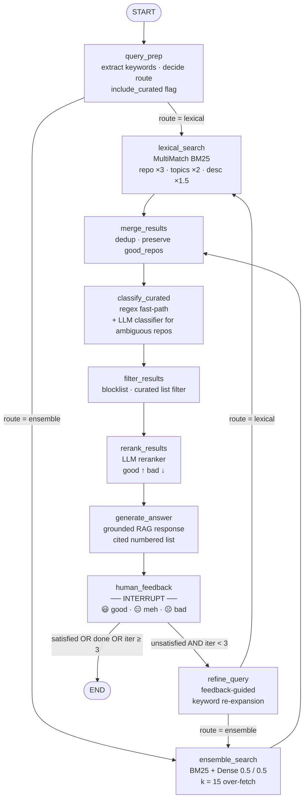

# AskMyBookmark — LangGraph Orchestrator Walkthrough

This document explains every node and edge in the compiled LangGraph orchestrator graph.
Use it as a reference during a demo or code review.

---

## Diagram

> All LLM steps (`query_prep`, `classify_curated`, `rerank_results`, `generate_answer`, `refine_query`) use `gpt-4o-mini` with structured output where applicable.
> Retrieval draws from two indexes built at startup: a `SearchArray` multi-field BM25 index and a per-user on-disk Qdrant vector store (`text-embedding-3-small`).

---

## Node-by-node commentary

### `__start__` → `query_prep`

Every session begins the moment the user submits a question. The first thing the graph does is hand that raw natural language string to `query_prep`. Nothing has been searched yet — this node's entire job is to *think about the query before touching any index*.

---

### `query_prep`

This is the brain of the retrieval system. It calls `gpt-4o-mini` with structured output, meaning the model is forced to return a typed JSON object rather than free text. It performs four tasks in a single LLM call:

**1. Keyword extraction** — strips conversational filler ("do I have any repos about…", "show me my starred…") and pulls out only the signal-bearing terms: technology names, library names, domain concepts, programming languages. A query like *"What machine learning repos did I save?"* yields keywords like `["machine learning"]`.

**2. Synonym expansion** — for each keyword it generates closely related technical terms. `machine learning` might expand to `["deep learning", "neural network", "ml", "sklearn", "pytorch"]`. These synonyms are fed into the BM25 search to cast a wider lexical net without the user having to think of them.

**3. Route decision** — decides between two search strategies:
- `lexical` — chosen only when the query is literally bare keywords with no sentence structure, like typing `"pytorch transformers cuda"` directly. This is intentionally rare.
- `ensemble` — the default for any natural language question, conversational phrasing, or anything with a verb. When in doubt it always picks ensemble.

**4. `include_curated` flag** — decides whether curated list repos (awesome lists, link collections, reading lists) should be included in results. Set to `True` only if the user explicitly asks for resources, courses, or collections. For queries like *"show me a good vector database library"*, it is `False`, which will later cause the filter step to remove those noisy list repos from the results.

The output of this node shapes every subsequent step.

---

### `query_prep` → `lexical_search` or `ensemble_search`

The first conditional edge. Based on the `route` field set by `query_prep`, the graph takes one of two branches. For almost all real queries this goes to `ensemble_search`.

---

### `lexical_search`

Uses the `MultiMatchBM25Retriever`, a custom retriever built on top of `SearchArray` — a pandas-native BM25 library. What makes it different from a standard BM25 retriever is that it searches *across multiple fields simultaneously* with different boost weights:

| Field | Boost | Rationale |
|---|---|---|
| `repo` name | **3×** | The repo name is the most concentrated signal |
| `topics` | **2×** | GitHub topic tags are short and precise |
| `description` | **1.5×** | Usually one sentence, low noise |
| `content` (full README) | **1×** | Most informative but also most noisy |

It uses a *dismax* scoring strategy: for each query term it takes the *best* field score rather than summing them. This prevents a repo from winning simply because the query term appears 30 times in a long README.

A secondary standard `BM25Retriever` (no field boosts) is also run and any documents not already seen are appended. This ensures recall is not lost for repos the multi-field retriever might have ranked lower.

---

### `ensemble_search`

Uses LangChain's `EnsembleRetriever` with two retrievers at equal weight (0.5 / 0.5):
- The same `MultiMatchBM25Retriever` described above
- A Qdrant dense vector retriever using `text-embedding-3-small` embeddings

Both retrievers fetch 15 candidates (`k=15`) — this intentional over-fetch gives the downstream reranker more to work with. The ensemble merges the two result sets using Reciprocal Rank Fusion (RRF), which rewards documents that rank highly in *both* retrieval methods without requiring you to calibrate score scales between them.

The dense retriever catches semantic similarity that BM25 misses. A query about *"finance"* finds repos tagged `quantitative-analysis` or `algorithmic-trading` even if the word "finance" never appears in their README.

---

### `merge_results`

A lightweight deduplication step. It builds a seen-set of repo names and walks both the BM25 and dense result lists, adding each unique repo once.

The important detail: it *prepends* any `good_repos` that were saved from a previous feedback round. If the user marked a repo as 😃 in round one, it is guaranteed to stay in the result set for round two even if the new search query would not have surfaced it — those repos are explicitly preserved across iterations.

---

### `classify_curated`

This node addresses one of the core failure modes discovered during evaluation: *curated list contamination*. Repos like `awesome-machine-learning` or `best-of-ml-python` have READMEs that are essentially ranked lists of hundreds of other libraries. Both BM25 and dense retrieval are strongly biased toward them for almost any query — BM25 because of term frequency, dense because their embedding is semantically close to the query at an abstract level.

This node classifies every candidate as `is_curated_list: True/False` using a two-stage approach:

**Stage 1 — regex fast-path** catches obvious cases instantly with no API call:
- Repo name matches `*/awesome-*` → curated
- Topics include `awesome-list` or `curated-list` → curated
- Description contains phrases like *"a curated list of"* or *"collection of resources"* → curated
- Description contains phrases like *"is a Python library"*, *"official PyTorch implementation"* → real project

**Stage 2 — LLM classifier** handles the ambiguous cases that the regex cannot resolve. All ambiguous candidates are batched into a single `gpt-4o-mini` call with a detailed system prompt containing 15 worked examples (both curated and real). The model returns a structured JSON array with a classification and brief reasoning for each candidate.

The result is an `is_curated_llm` flag on every document's metadata, which the next node uses to filter.

---

### `filter_results`

Applies the classifications from the previous step to remove documents from the candidate pool:

- Any repo in the user's **blocklist** (repos rated ☹️ in a prior round) is unconditionally removed — they should never appear again.
- Any repo classified as a curated list is removed, unless `include_curated` is `True`.

There is a **safety floor**: if filtering would leave fewer than `min(top_k, 3)` results, the filter is progressively relaxed — first allowing curated lists back in, then allowing blocklisted repos back in — to ensure the answer always has something to work with.

---

### `rerank_results`

After filtering, the remaining candidates are re-ordered by a second `gpt-4o-mini` call. Each candidate is formatted with its repo name, description, topics, language, and curated-list status, and the model is asked to rank them from most to least relevant for the original query.

If there is prior feedback from an earlier round, each candidate's prior rating is shown inline in the prompt:

| Rating | Instruction to model |
|---|---|
| 😃 good | *"Prior feedback: 😃 Good"* — rank near the top |
| 😑 meh | *"Prior feedback: 😑 Meh"* — rank in the middle |
| ☹️ bad | *"Prior feedback: ☹️ Bad (rank lower)"* — rank at the bottom |

This makes the feedback loop directly affect ordering, not just the next retrieval. The top `top_k` (default 10) results are kept after reranking.

---

### `generate_answer`

The final retrieval-augmented generation step. The reranked, filtered, classified documents are formatted into a structured context block — each entry has the repo name, URL, description, topics, language, star count, and curated-list label. This is passed to `gpt-4o-mini` with a carefully constrained system prompt:

- It may **only** surface repos that appear in the retrieved context. It cannot invent or suggest repos from general knowledge.
- If no retrieved repos are relevant, it must say so honestly and suggest rephrasing.
- It must format the response as a **strict numbered list from 1 to N** — every number must appear exactly once, no skipping, no closing summary paragraph.
- Language and Stars are shown inline when present; if missing for a given repo, they are omitted rather than printed as placeholders.

The response streams token-by-token back to the frontend via Server-Sent Events (SSE), so the user sees the answer being written in real time.

---

### `human_feedback` — the INTERRUPT

This is what makes this an *agentic* system rather than a simple RAG pipeline. The graph pauses here using LangGraph's `interrupt` mechanism — it does not proceed to any edge until the frontend explicitly resumes it.

The user sees the answer and a list of results, each with three emoji buttons: 😃 good, 😑 meh, ☹️ bad. When they submit ratings and click "Refine", the frontend calls `POST /api/session/feedback`, which resumes the graph by injecting the ratings dictionary as `Command(resume=ratings)`.

The node then:
- Adds all 😃 repos to the persistent `good_repos` list (carried forward to the next round via `merge_results`)
- Adds all ☹️ repos to the `blocklist` (never shown again, filtered in `filter_results`)
- Increments `feedback_iteration`

---

### `human_feedback` → `refine_query` or `__end__`

The conditional edge after the interrupt checks in order:

1. Did the user click "Done" (the `__stop` flag)? → `END`
2. Is `feedback_iteration >= 3`? → `END` (maximum 3 refinement rounds)
3. Are there any `bad` or `meh` ratings? → `refine_query` (loop continues)
4. Otherwise (all `good`) → `END`

---

### `refine_query`

The re-entry point for the feedback loop. It calls `gpt-4o-mini` with a different system prompt — the **feedback refinement prompt** — that instructs it to:

- Look at the 😃 repos and generate new search terms that would find *more repos like these*, using their descriptions, topics, and names as signal
- Look at the ☹️ repos and identify *why* they were wrong (wrong language? wrong abstraction level? curated list when a real project was wanted?) and avoid those patterns
- Update the `route` and `include_curated` decisions if the feedback reveals a clear pattern

The output is a new `QueryPrepOutput` — exactly the same structure as `query_prep` — which feeds back into the same routing edge, sending the refined query back through `lexical_search` or `ensemble_search` for another pass. The whole pipeline reruns with the new keywords, but with the `good_repos` already locked in at the top of `merge_results`.

---

## Edge summary

| Edge | Type | Condition |
|---|---|---|
| `__start__` → `query_prep` | Unconditional | Always |
| `query_prep` → `ensemble_search` | Conditional | `route == "ensemble"` |
| `query_prep` → `lexical_search` | Conditional | `route == "lexical"` |
| `ensemble_search` → `merge_results` | Unconditional | Always |
| `lexical_search` → `merge_results` | Unconditional | Always |
| `merge_results` → `classify_curated` | Unconditional | Always |
| `classify_curated` → `filter_results` | Unconditional | Always |
| `filter_results` → `rerank_results` | Unconditional | Always |
| `rerank_results` → `generate_answer` | Unconditional | Always |
| `generate_answer` → `human_feedback` | Unconditional | Always |
| `human_feedback` → `refine_query` | Conditional | Has `bad`/`meh` AND `iter < 3` AND not `__stop` |
| `human_feedback` → `__end__` | Conditional | Done, all good, or `iter >= 3` |
| `refine_query` → `ensemble_search` | Conditional | `route == "ensemble"` |
| `refine_query` → `lexical_search` | Conditional | `route == "lexical"` |
